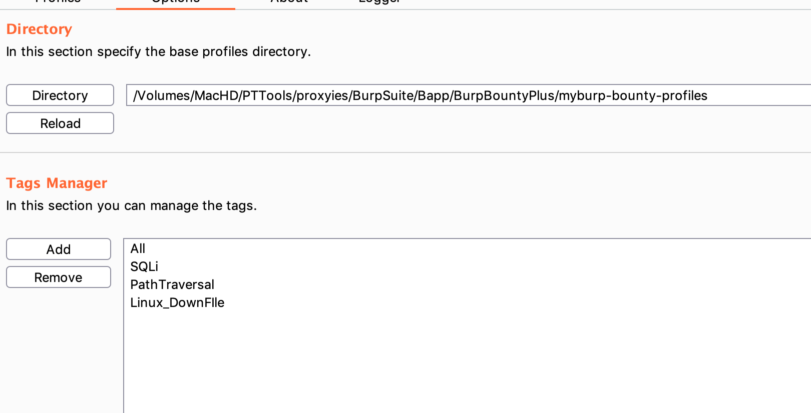
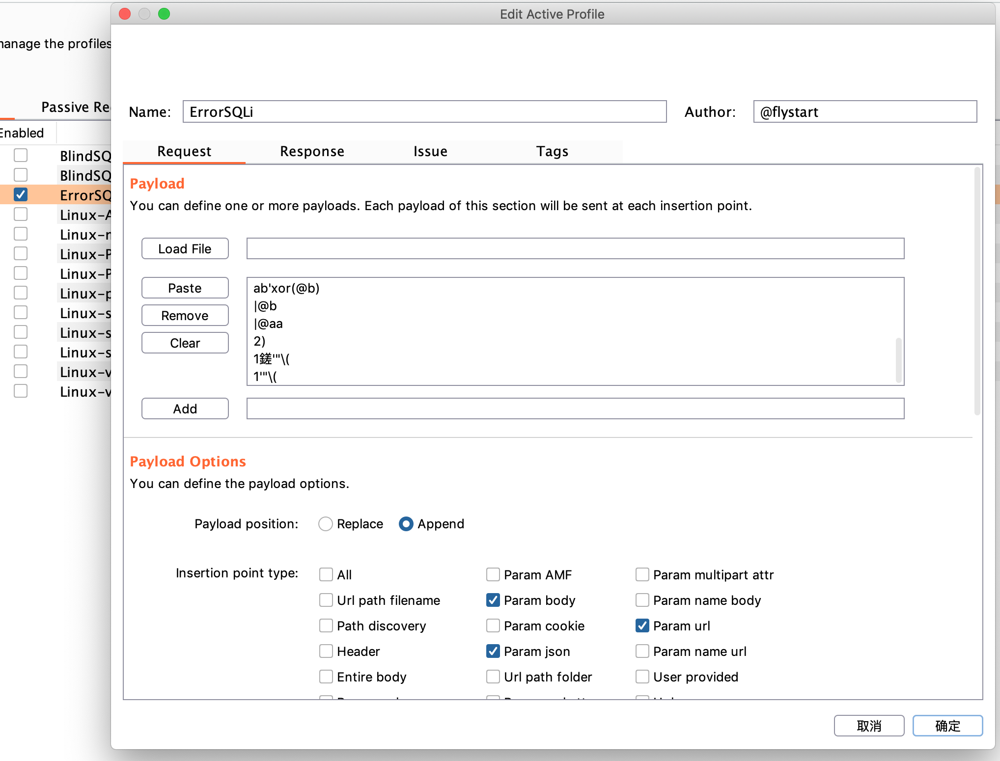
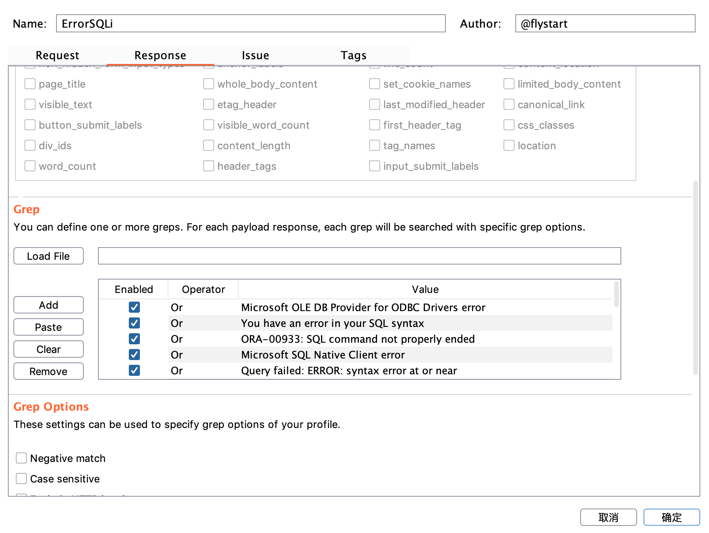
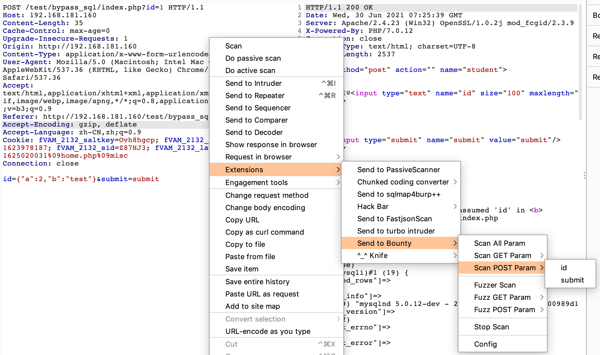
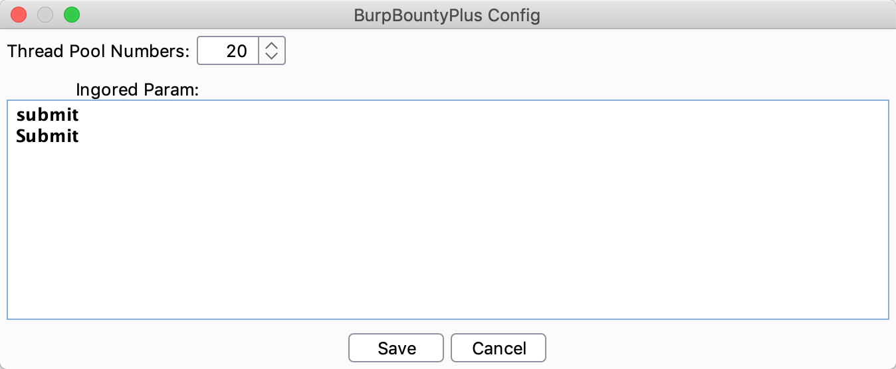
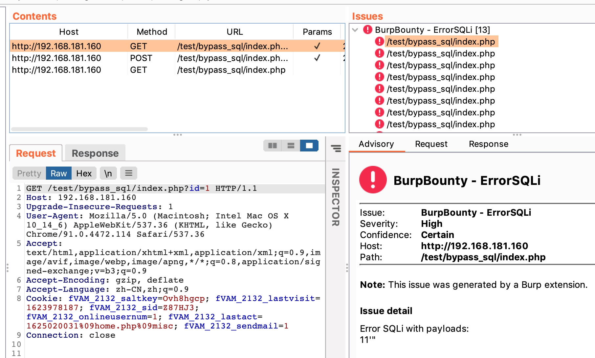
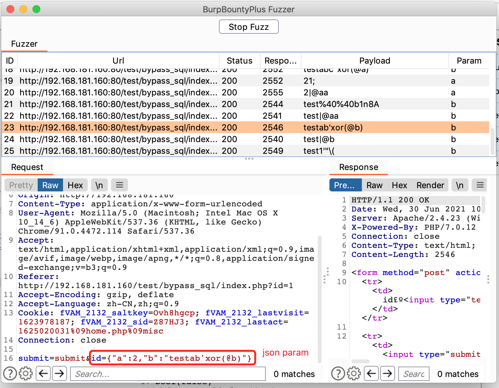

# **提升渗透测试之路最后一公里之速度**

# 简介：

BurpBountyPlus 是在BurpBounty的基础添加了右键菜单功能，添加支持了对单个数据包单个参数的漏洞扫描和fuzzer，打通渗透测试的最后一公里，提高效率。

# 功能：

|       菜单       |                            功能                             |
| :--------------: | :---------------------------------------------------------: |
|  Scan All Param  | 对所有参数【PARAM_BODY\|PARAM_URL\|PARAM_JSON】进行漏洞扫描 |
|  Scan Get Param  |                 单独扫描GET[]里面的每个参数                 |
| Scan POST Param  |                单独扫描POST[]里面的每个参数                 |
|  Fuzz All Param  |   对所有参数【PARAM_BODY\|PARAM_URL\|PARAM_JSON】进行Fuzz   |
|  Fuzz Get Param  |                单独fuzz POST[]里面的每个参数                |
| Fuzz  POST Param |                单独fuzz POST[]里面的每个参数                |
|    Stop Scan     |                     停止所有的漏洞扫描                      |
|      Config      |         配置对话框【线程池数量\|忽略测试的参数名】          |

# 引子：

渗透测试一般情况下如果目标没有waf的情况我们会使用主动扫描器和被动扫描器对目标进行扫描测试，但是有时侯在有waf拦截或扫描器无果的情况下我们就需要凭借我们的经验和利用收集的payload重放数据包文进行手动测试了，测试的时候我们一般是发送到Intruder 配置自定义字典进行测试分析结果，但是每个参赛都这样做难道不觉得麻烦吗？有没有一款插件可以单独对一个数据包里面的参数单独进行设置字典测试呢？我咨询了很多人抱歉没有找到这样一款插件，但是我发现BurpBounty是一款不错的插件，公开免费版本仅仅实现扩展了主动扫描和被动扫描，试用之后认为他的最大亮点就是把对每个漏洞的检测方式、检测payload、漏洞定义等漏洞相关信息配置文档化，这是个不错实现思路，对于一种新型漏洞的检测，只需要定义检测方式和检测payload生成检测文件即可。

在阅读了他的源码之后，我发现他的核心功能正是我所需要的，所以我改造的这款插件就是对BurpBounty 核心功能的组装，漏洞扫描模块忽略小的改动基本是完全复制，主要添加了一下功能特色：

1） 添加了fuzzer功能

2）添加了漏洞扫描过程显示窗口logger并对发现的漏洞项进行高亮显示

3）添加了忽略参数设置和手动Stop

# 手册：

## 添加配置文件

1.加载漏洞配置文件

可以在这里下载网友分享的配置文件进行改写

https://github.com/SummerSec/BurpBountyProfiles

2 修改测试payload、参数来源

3. 配置检测方式

   

   添加好漏洞检测配置文件之后就可以使用了，**如果不添加的右键并不会出现测试菜单**。

# 展示:

## 右键菜单

## 配置窗口

## 	漏洞扫描展示面板

## Fuzz 窗口

# 致谢:

BurpBounty 全体作者

https://github.com/wagiro/BurpBounty

@bit4woo

https://github.com/bit4woo/burp-api-drops

@LoggerPlusPlus

https://github.com/nccgroup/LoggerPlusPlus

# 说明：

本人不太会JAVA ，本项目完全面向github和百度开发完成，bug问题在所难免：）大家有能力可自行魔改

**待解决的问题和不足：**

1）由于核心检测功能使用了BurpBounty，在对 json格式的参数测试的时候不能很好的判断数据类型，故统一按照String类型处理

2）漏洞扫描模块使用了单线程，如果要使用使用多线程的话，核心检测功能需要做较大的改动，所以这一块暂时搁置

3）Fuzzer 结果筛选功能暂时未做,大家可以使用burp的logger功能进行筛查分析（最新版本挺香）

要解决以上问题 代码改动较大，完全在此工程上修改的话比较复杂麻烦，所以以后可能会重构一个全新的版本，至于什么时候等我学会了JAVA吧

